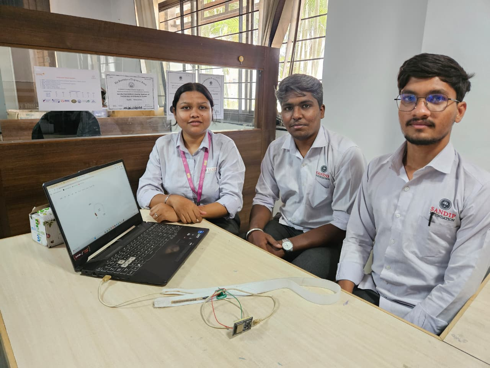
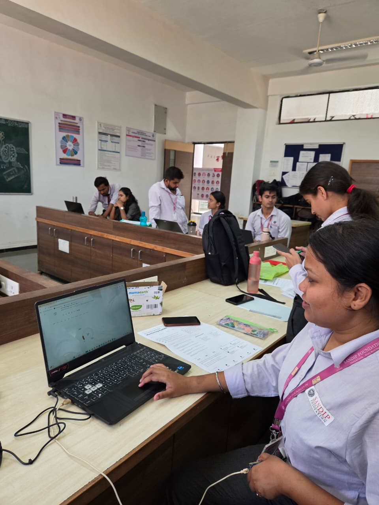
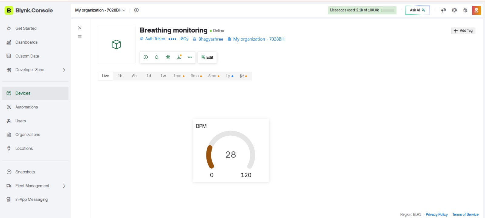
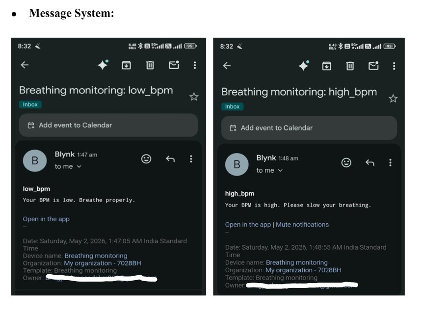
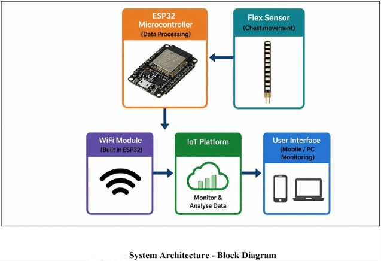
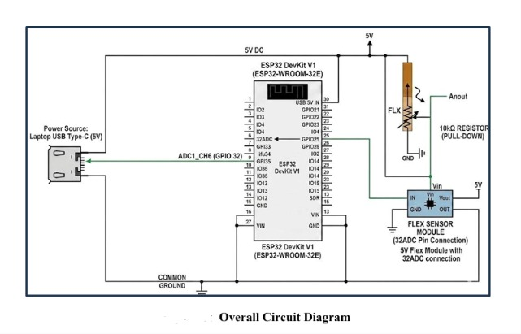

# Implementation of IKS for Pranayama using STEM Approach

## 📌 Project Overview
This project is an IoT-based Breathing Rate Monitoring System developed using ESP32 and Flex Sensor. The system measures chest movement during inhalation and exhalation and calculates breathing rate in BPM (Breaths Per Minute).
The project was developed as part of implementing pranayama monitoring using STEM approach and IoT technology.

## 🚀 Features
- Real-time BPM monitoring
- Flex sensor-based chest movement detection
- IoT dashboard using Blynk
- High BPM alert notification
- Low BPM alert notification
- Wireless monitoring using ESP32 WiFi

## 🛠 Components Used
- ESP32 DevKit V1
- Flex Sensor
- 10k Resistor
- Jumper wires
- USB cable and power supply
- Blynk IoT Platform
  

## ⚙️ Working Principle
The flex sensor is attached around the chest area. During inhalation and exhalation, chest movement bends the sensor and changes its resistance. ESP32 reads these analog values, processes them and calculates breathing rate in BPM.
The calculated BPM is displayed on the Blynk cloud dashboard. Alert notifications are generated for abnormal breathing conditions.

# 📷 Project Demonstration

## Main Project Demo
.

## Working Demonstration

## Prototype Competition Presentation

# 📊 Blynk Dashboard

# ⚠️ Alert Notification System

# 🧠 System Architecture

# 🔌 Circuit Diagram

# 📄 Project Report
Complete mini-project report available here:
[Download Report](FINAL BPM_REPORT.pdf)

# 💻 Technologies Used
- Embedded Systems
- ESP32
- Flex Sensor
- Arduino IDE
- Blynk IoT Platform
- IoT Monitoring

# 🔮 Future Scope
- Smart healthcare monitoring
- Mobile application integration
- Cloud-based patient monitoring
- AI-based breathing analysis
- Wearable health monitoring device

# 📂 Source Code
Code available in:
breathing_monitoring_system.ino

# 👨‍💻 Developed By
- Bhagyashree Gadekar
- Sidhesh More
- Ishan Purne
